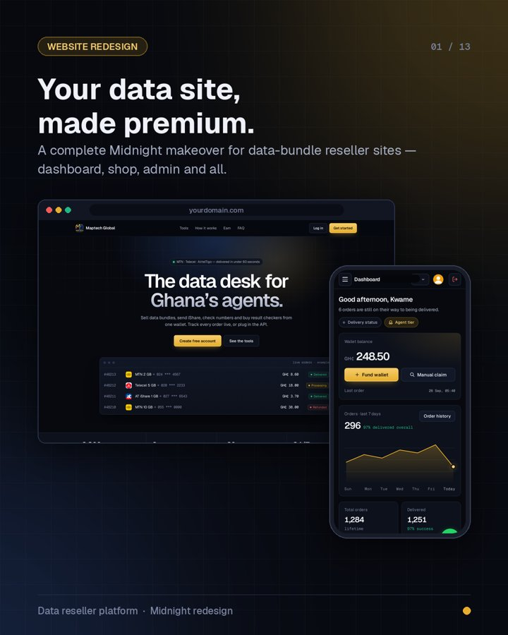
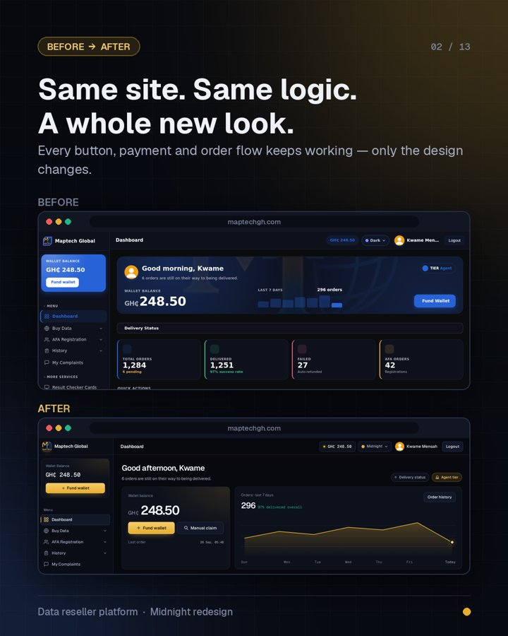
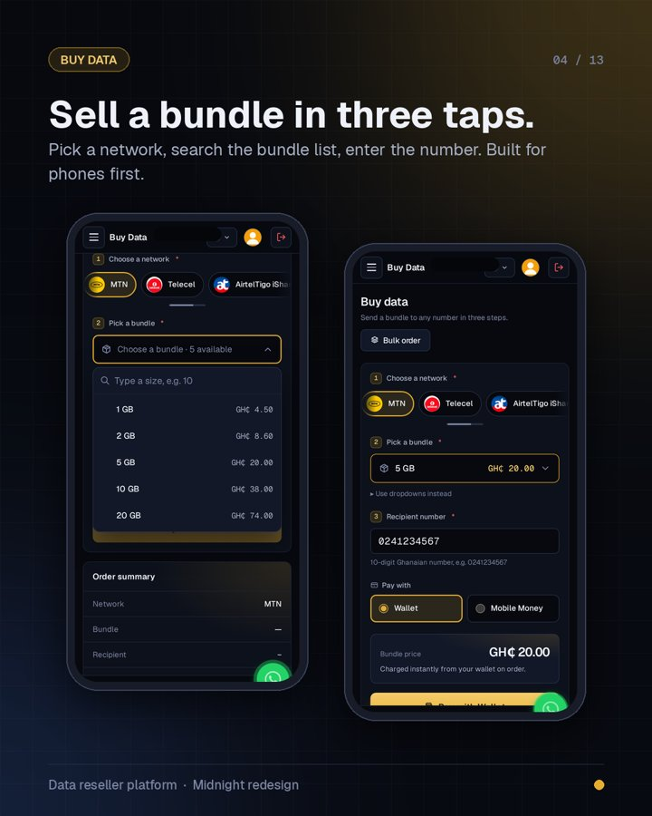

# Web Experience Kit — Claude skills for building better websites

A Claude skill that gives an old, plain website a full modern makeover — **safely**.
Built for Ghana data-bundle reseller sites (custom PHP MVC), but works for similar PHP sites.

It was made while redesigning **[maptechgh.com](https://www.maptechgh.com)** ("Midnight" theme).

<p>
  
  
  
</p>

## All skills in this kit

| Skill | What it does | Download |
|---|---|---|
| ⭐ **web-experience-pro** | **All-in-one:** every skill below in one, plus a new **Premium polish** mode that makes any app look expensive (premium audit score + recipe + 5 luxury theme presets) and a **Full pipeline** mode that reviews → designs → builds → polishes → re-reviews. Install this one if you only want one. | [zip](web-experience-pro.zip) |
| **site-redesign-5-variants** | Redesigns an existing site safely — shows 5 design directions first, then applies your pick in stages. | [zip](site-redesign-5-variants.zip) |
| **ui-ux-pro-max** | Design brain for apps & sites: picks the right style, colours, font pairing, spacing and layout for your product type, builds it, and checks it on phone + desktop. | [zip](ui-ux-pro-max.zip) |
| **bug-hunt-review** | Strict code reviewer: walks through a diff/PR/folder, hunts real bugs & security holes (SQL injection, double refunds, race conditions…), proves them, and gives a fix for each with a ship/don't-ship verdict. | [zip](bug-hunt-review.zip) |
| **component-lab** | Builds polished copy-paste UI components & sections (hero, pricing, tables, modals, forms…) in React/Tailwind or plain HTML/CSS/PHP, with variants and a live preview. | [zip](component-lab.zip) |

**Example prompts**
- *web-experience-pro:* "Use web-experience-pro to make my app look premium." / "Use web-experience-pro full pipeline on my site."
- *ui-ux-pro-max:* "Use ui-ux-pro-max to design the dashboard for my data-bundle app."
- *bug-hunt-review:* "Use bug-hunt-review on my latest changes before I upload them." / "Review this PR: <link>"
- *component-lab:* "Use component-lab to make a pricing section for MTN, Telecel and AT bundles in plain HTML/CSS."

Install any of them the same way as below — just pick that skill's zip or folder.

> These skills are original, independent work by M-AVETECH IT SERVICES. They are not affiliated with or
> endorsed by any other tool or company.

## site-redesign-5-variants — what it does

1. **Looks around first** – maps your pages, layouts, CSS, fonts and icons. Changes nothing.
2. **Shows you 5 different design directions** in one preview page (dark premium, clean light,
   bold colourful, minimal, glassy…) with your dashboard, Buy Data screen and a phone view —
   then **waits for you to pick** (or mix: “take 2 and 4”).
3. **Applies your choice in stages** – layouts & dashboard → buy data, wallet, history →
   admin & shops → the rest.
4. Offers a set of **promo images** at the end so you can advertise the new look.

**Safety rules it follows**
- Visual changes only: form names, routes, CSRF tokens, scripts and controllers stay the same.
- Never overwrites your live files – every stage goes into its own `_redesign_stageN` folder
  with an `INSTALL.txt` telling you what to copy and what to back up.
- Never reads `.env`, passwords, database dumps, logs or uploads.
- Checks every page on desktop **and** phone before handing it over.

## Install

### Claude app (claude.ai – web, desktop or mobile)
1. Download **[`site-redesign-5-variants.zip`](site-redesign-5-variants.zip)** (click it, then the download button).
2. In Claude, open **Settings** and find **Skills** (under Capabilities / Customize).
3. Choose **Upload skill** and pick the zip. Make sure the skill is switched on.

### Claude Code
```bash
git clone https://github.com/MAPTECHGH/web-experience-kit.git
mkdir -p ~/.claude/skills
cp -r web-experience-kit/site-redesign-5-variants ~/.claude/skills/
# or all of them:
cp -r web-experience-kit/{web-experience-pro,site-redesign-5-variants,ui-ux-pro-max,bug-hunt-review,component-lab} ~/.claude/skills/
```

## Use it

Give Claude your site's source code (attach a zip, or link the folder on your computer) and say:

> Redesign my site with the site-redesign-5-variants skill. Show me the 5 directions first.

Then pick a direction and say **“stage 1”**, **“next”**, and so on.

## Files
- `site-redesign-5-variants/SKILL.md` – the skill itself (plain text, easy to read and edit)
- `site-redesign-5-variants.zip` – same thing, zipped for uploading to Claude
- `web-experience-pro/` (+ `.zip`) – the all-in-one skill
- `ui-ux-pro-max/`, `bug-hunt-review/`, `component-lab/` (+ their `.zip` files) – the other skills
- `preview/` – example images from the maptechgh.com redesign

---
Made by **M-AVETECH IT SERVICES** · Want your site redesigned for you instead? Visit [mavetechservices.com](https://www.mavetechservices.com).
